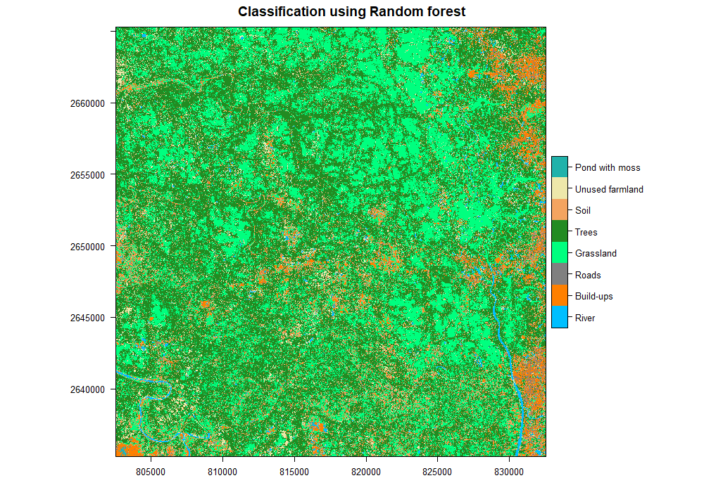

# RS-RF-Classification
Supervised Classification of Sentinel-2 raster data in R using Random Forest algorithm. The `signature.shp` file is created in `QGIS` using `SCP tool` which includes Classification class and spectral signature for those classes. As the input data is too big it is ignored.

### After Classification the raster looks like below:

For Accuracy of the RF model is calculated manually using groundtruth data using 100 random points. The file [errormatrix.xlsx](results/errormatrix.xlsx) explains all the formula for calculating the accuracy.

### The cross table for accuracy assesment looks like below:

_Overall Accuracy = 71%_
 

_Kappa Value = 65%_

# Requirements
This project is developed suing the following packages:

R version 4.0.3
`rgdal` 1.5
`e1071` 1.74
`snow` 0.43
`randomForest` 4.6